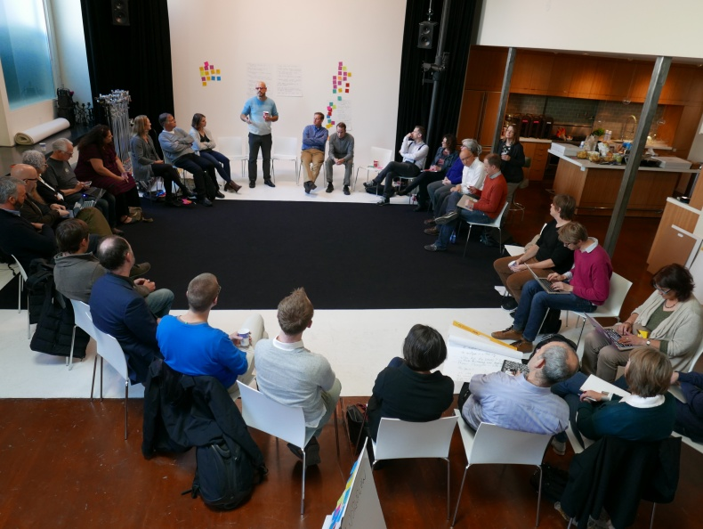

We're about to announce Stencila's first major round of funding. It's really exciting to at last have the opportunity to give this project the resourcing it needs and to launch into the next phase of this journey. 

More on that funding soon. But first, I want to acknowledge and thank some friends. Friends, without who's support I almost certainly wouldn't have got this funding, and possibly might have given up all together.

Eighteen months ago I stumbled across this guy called Adam Hyde. He had just been awarded a Shuttleworth Fellowship to help make scholarly publishing more immediate, accessible and replicable - pretty much what I was working on. He was also as a fan of Micheal and Oliver's [Substance](http://substance.io) - the library I was about to start using for Stencila's in-browser editing. And he was a kiwi! So, we had one or two things in common (although Adam is a real New Zealander, for me these wonderful, and at times shaky, little islands in the corner of the Pacific are my adoptive home)

, co-founder of the [Collaborative Knowledge Foundation](http://coko.foundation), founder of [BookSprints](https://www.booksprints.net/), founder of [FLOSS Manuals](http://www.flossmanuals.org/), artist, activist and broadcaster). Photo Shuttleworth Foundation.](adam.png)

I sent Adam an email - you know the type, "this is what I'm  working on", "would be nice to compare notes some time". To my surprise, a few weeks later I was at the inaugural community meeting of the Collaborative Knowledge Foundation (CKF or Coko). Coko is the foundation that Adam co-founded with Kristen Ratan, with the mission of changing the way that knowledge is produced and communicated. They're building open source technology solutions for academic publishing that foster collaboration, integrity, and speed. And they're doing that, not by building yet another silo, but by building a community. 

It is hard to imagine two people better suited to establishing such a foundation. Adam has a long and incredibly diverse career at the intersection of open source and publishing. He is an adept facilitator and a thoughtful and skilled writer (his website and blog, https://www.adamhyde.net/, is definitely worth checking out!). Kristen has an equally impressive resume as an innovator in scholarly research communication at several leading publishers and technology firms. So given their skills and experience, it was hardly surprising that Coko's efforts to improve scholarly publishing are backed by two well known foundations.

 

What is more unusual is the approach that they are taking. Instead of using it's reputation and funding for empire building, true to  name, the Collaborative Knowledge Foundation is fostering an ecosystem of like-minded open-source projects. Coko is not trying to swallow up smaller projects working on similar things, instead they are [helping them grow](https://coko.foundation/sowing-the-seeds-for-change/).

For Stencila, Coko's help came in the form of insightful advice, caring support and invaluable connections. All given without expectation of return - true "pay it forward" generosity. It is hard to overstate how important this type of help is for a fledgling open-source project. And it was essential in securing the funding required to give Stencila the wings it needs to fly.

Thanks Coko!

