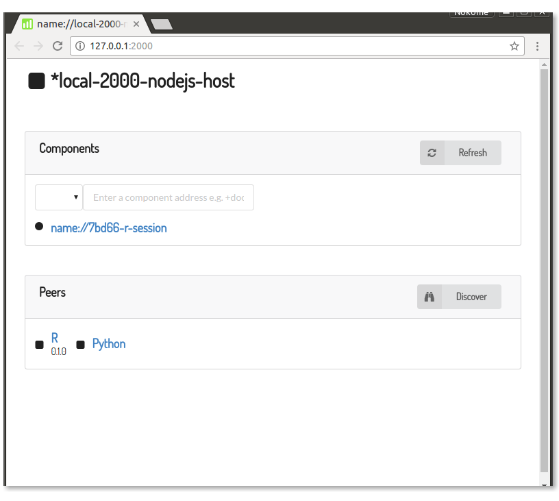
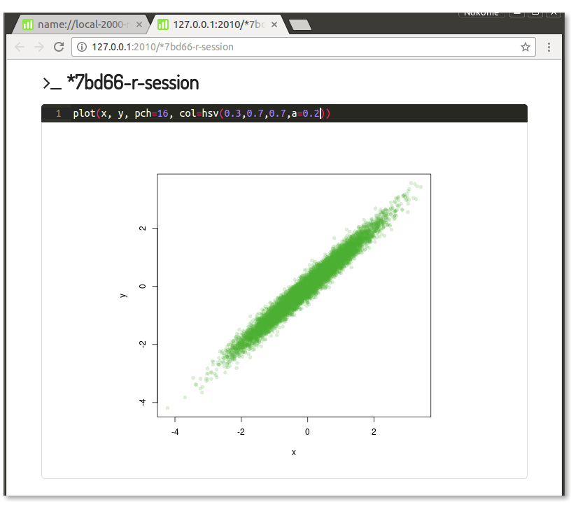
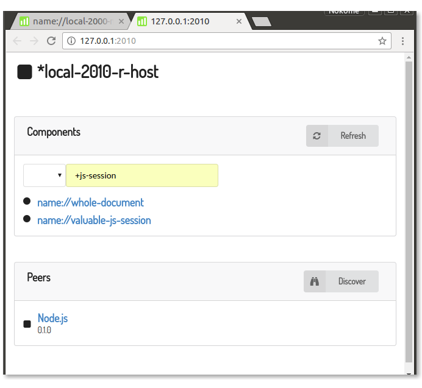

In my [last post](http://blog.stenci.la/geheimhaven) I talked about breaking up the architecture of Stencila to take it from a monolithic island to more of a connected archipelago. The platform's architecture was monolithic because it was based on a foundational C++ implementation which was then exposed to various host languages, like R and Python, using wrappers. While that approach had several advantages (e.g. implement once, distribute often) it also had some down sides (e.g. complex builds, intimidating for contributors). In the new approach, the various packages that make up the Stencila platform have been decoupled from each other and there is more of a focus on a standard set of APIs and communication protocols, rather than a single implementation. In this development update I'm going to give you a taste of what that actually looks like.

The core repository for Stencila was [`stencila/stencila`](http://github.com/stencila/stencila). That repo is still there, but now, instead of being the place where all the code resides, it's an umbrella repo which points to the other repos in the platform and will hold overarching documentation. Previously, the monolithc `stencila/stencila` repo had a mix of C++ code for the foundations, R and Python code for wrapper packages for those languages, and Javascript and CSS for web based interfaces. This could be confusing and for some intimidating - if you're a Python coder you want the Python package to look like a Python package with `setup.py` and all the other things you are used to seeing. Ditto if your a R or Node.js coder. Ditto if your a developer of browser based user interfaces.

So, now there are three separate repos for the R, Python and Node.js packages: 

- [`stencila/r`](http://github.com/stencila/r)
- [`stencila/py`](http://github.com/stencila/py)
- [`stencila/node`](http://github.com/stencila/node)

These will be your entry point to the platform if you're used to writing code in those languages. As I'll show you, when you use these packages you're not limited to code - each of these package has a Stencila 'host' which will serve up the browser based user interfaces. Those live in their own repo:

- [`stencila/web`](http://github.com/stencila/web)

They are also provided by the desktop application which is based on Github's [Electron](http://electron.atom.io/) and which lives at:

- [`stencila/electron`](http://github.com/stencila/electron)

In this post I'm going to illustrate how `stencila/r`, `stencila/py` and `stencila/node` can behave as a network of diverse peers. Peers in that each package is both a supplier and consumer of resources. Diverse in that each package bring different types of resources to the network.

So, lets start off with Node.js package. All the packages are in initial stages of development but the Node.js package has had more work done on it at this stage - mainly because it provides an easy pathway to desktop deployment via Electron. 

You can install the package using NPM,

```sh
$ npm install stencila/node -g
```

Then start Node, import the package and get the host in that package to start serving,


```js
// Import the Stencila package
> const stencila = require('stencila')

// The package has a host object
> let host = stencila.host

// Serve the host so it is available to other hosts as a peer
> host.serve()
```

That starts an embedded HTTP server listening on port 2000 at localhost. You can check that it's running using Curl, or my favorite tool for the job, httpie,

```sh
$ http --json :2000
HTTP/1.1 200 OK
Connection: keep-alive
Content-Length: 583
Content-Type: application/json
Date: Mon, 05 Dec 2016 04:31:00 GMT

{
    "address": "name://local-2000-nodejs-host", 
    "components": [], 
    "id": "0652ede4c50877da6db78a7803d2b988a14d5e545f149647f4c0030a712d6858", 
    "kind": "host", 
    "package": "node", 
    "peers": [], 
    "schemes": {
        "dat": {
            "enabled": false
        }, 
        ...
    }, 
    "short": "*local-2000-nodejs-host", 
    "type": "nodejs-host", 
    "types": {
        "bash-session": {
            "formats": []
        }, 
        "document": {
            "formats": [
                "html"
            ]
        }, 
        ...
    }, 
    "url": "http://127.0.0.1:2000"
}
```

Because this is the only Stencila host, it's list of peers is empty,

```js
> host.peers
[]
```

So, let's start Stencila hosts in both R and Python. 

You can install the R package from within R using `devtools`,


```r
# Install the Stencila package
> devtools::install_github("stencila/r")

# Import it
> library(stencila)

# Serve the host so it is available to other hosts as a peer
> host$serve()
[1] "http://127.0.0.1:2010"
```

Let's also get a Python host going by installing the Python package using PIP,

```sh
pip install --user https://github.com/stencila/py/archive/master.zip
```

and then serving it from within Python, 

```py
# Import the Stencila package
>>> from stencila import host

# Serve the host
>>> host.serve()
'http://127.0.0.1:2020'
```

Let's now go back to the Node.js host and see what it's `peers` property looks like now,

```js
// Discover peers on localhost
> host.discover()

// Get list of peers
> host.peers
[ { stencila: true,
    package: 'r',
    version: '0.1.0',
    id: 'cc7b797258a0b981f94cf6358a84ab8b55cbdd9d4944f486d9cfff6e35e74',
    url: 'http://127.0.0.1:2010',
    schemes: [ 'new', 'id', 'file' ],
    types: [ 'r-session', '' ],
    formats: [ '', '' ] },
  { schemes: [ 'new' ],
    stencila: true,
    package: 'py',
    url: 'http://127.0.0.1:2020',
    formats: [ 'md' ],
    id: 0,
    types: [ 'document', 'py-session' ] } ]
```

So, the Stencila host in the Node.js now recognizes the hosts in R and Python as it's peers and can request resources from them. In Stencila we call these resources _components_. Components include _documents_, _sheets_, and _sessions_ and hosts have an `open` method that can be called to get a component and load it into memory. If a host does not know how to open a particular component then it will ask it's peers to open it on it's behalf. To illustrate this we'll open and R session from within Node.js,

```js
// Open a R session from within Node.js
// (behind the scenes the R session is actually created by the R host)
> let r
> host.open('new://r-session').then(session => r = session)

// Do some silly stuff with it like calculate the 
// correlation between random numbers
> r.execute(`
	x <- rnorm(1e4)
	y <- x + rnorm(1e4, 0, 0.2)
`)
> r.print('cor(x,y)').then(console.log)
```

The object `r` is actually a proxy for the `RSession` instance which is hosted by the R host. When you call it's methods `execute` and `print` those calls are serialised and sent as a remote method calls to that instance. 

You don't need to do all this at the command line. Instead you can use the browser-based user interfaces. The easiest way to do that is to launch a browser window using the `view` method:

```
host.view()
```

That will open a browser window at the URL that the host is serving on. It shows a list of components that this host is currently hosting (currently just that R session we created above) as well as list of it's peers:



Each Stencila component has a browser-based interface, so if we click on that link to the R session, we get an interactive command line where we can do something like plot those random series `x` and `y` which we previously generated within the session:



Or, we can click on the link to the R peer, get the interface for the host residing in R, and ask for components that the Node.js host knows about, like _documents_ and _Javascript session_ from there:



That's a very quick introduction on how the various Stencila packages can work together as a network of diverse peers with differing capabilities. Over time the capabilities of all these packages will increase. But in the meantime, if there is something missing in the package for you favorite language, you can always run a host from a different language and pull resources from there. Right now we have a *very* simple peer discovery mechanism which only works locally. But the plan is to extend that so that peers will be able to reside on different machines.

In the next development update, I'll show how we can combine the _document_ and _session_ components into a dynamic, data driven document.
