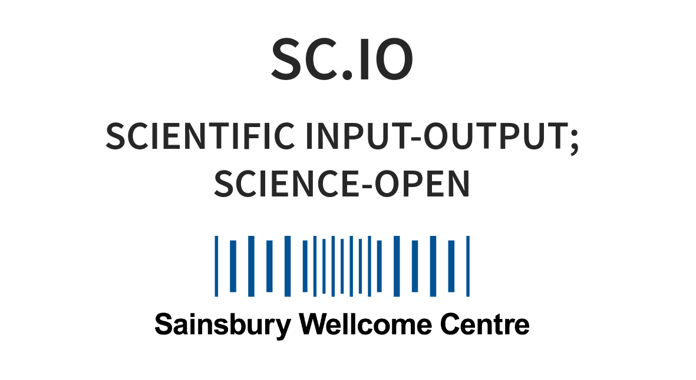

We were invited to give a short presentation about Stencila and open science workflows at the [Open Neuroscience meeting](https://kampff-lab.github.io/sc.io/) hosted at [Sainsbury Wellcome Centre at the University College London, UK](http://www.ucl.ac.uk/swc).

{style="width: 80%;" }

One of the organisers, Gonçalo Lopes of [the Kampff Lab](http://www.kampff-lab.org/) described the aims of the event:

> For this event we are bringing together several individual researchers and
> groups from the London area that want to collaborate and share their science
> openly. The goal is to grow a critical mass and help our local network of
> scientists to use open science workflows more easily.
>
> We want to compare individual experiences, methods, and skill sets, and
> discuss possible standards to facilitate exchange and collaboration.
> Finally, we want to discuss how to make our process more accessible to life
> scientists who may not be so familiar or comfortable with online tools and
> programming.

Nokome Bentley joined the meeting remotely and discussed the principles behind Stencila:

* merging the concepts of documents, data and code into 'executable documents';
* blurring the lines between coders and non-coders;
* alternative, but unified, computing interfaces for alternative types of users;
* making reproducible research more accessible.

