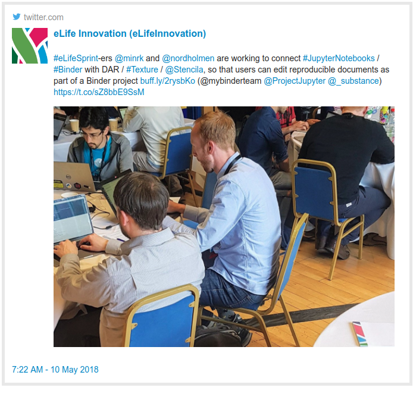
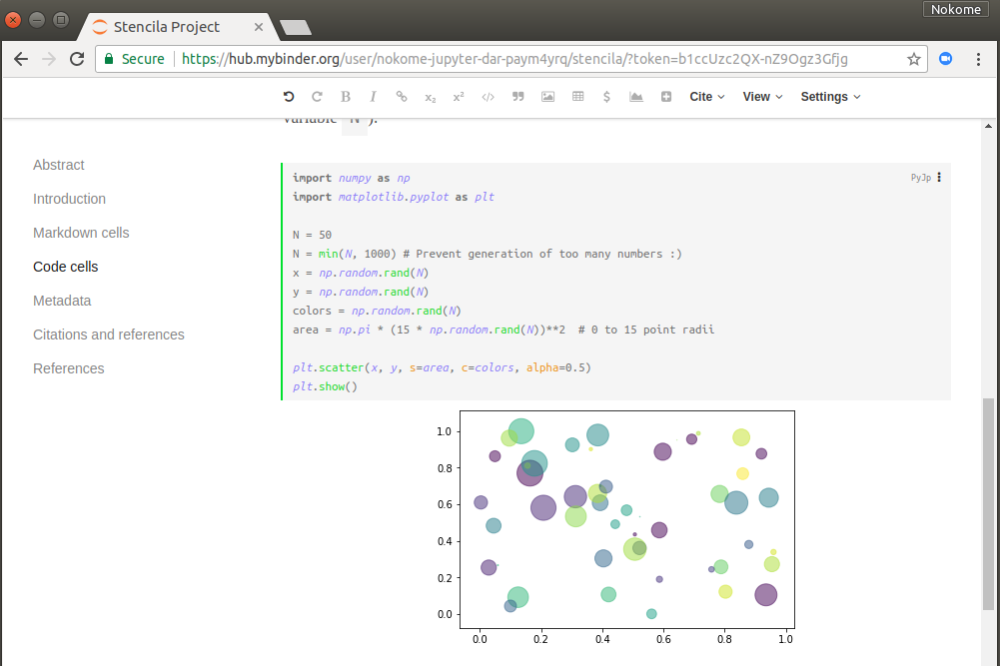

At the recent eLife sprint in Cambridge [Daniel Nüst](https://twitter.com/nordholmen) and [Min Ragan-Kelley](https://github.com/minrk) of Project Jupyter had chosen to do a project involving Stencila.
Nokome Bentley joined them remotely and as a result  you can now run Stencila projects on Binder connecting to a Jupyter kernel.

The project is putting the Stencila editor into a Docker container that can be launch with [Binder](mybinder.org) enabling editing of [Dar archives](https://github.com/substance/dar). Check out the [Github repository](https://github.com/minrk/jupyter-dar).

Nokome spent the day working on adding support for running code cells. Since the base `jupyter/minimal-notebook` image already has a Jupyter kernel for Python installed he decided to enable Stencila's `JupyterContext`. It acts as a bridge between Stencila's API and Jupyter kernels. Nokome included the `stencila-node` Node.js package in the Docker image which provides the JupyterContext as well as a `NodeContext` (for executing Javascript) and a `SqliteContext` (for executing SQL).

Here's the result: a Stencila project running on Binder connecting to a Jupyter kernel

