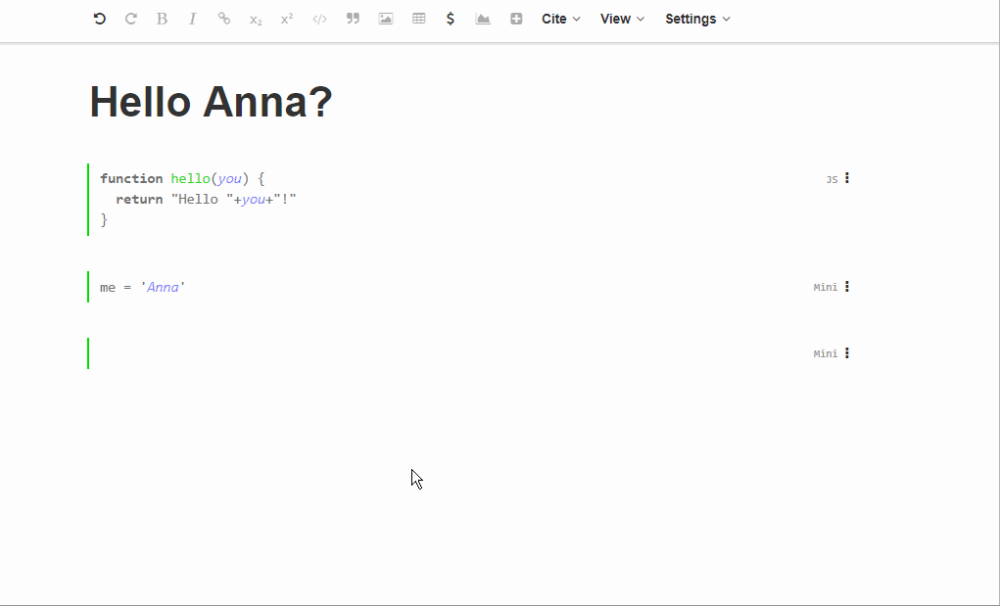

# Custom Functions in Stencila

Nokome Bentley and Oliver Buchtala have investigated options to achieve this and found a very simple and generic solution. Stencila Cells can return a special value of type `function`. This does not differ very much from other return values, such as a `number`.
Returned functions are however special, they are passed around just as the information necessary to ask the Stencila Host to actually run the function.
This approach introduces only a rather tiny concept, but has a huge impact: for example a cell executed in R can register a function, which can be executed in every other context, e.g. in Javascript.
Reactive evaluation, i.e. automatic updates, are coming for free, as functions are just treated as regular values.

## Example

A function could be defined in Javascript
```
function hello(you) {
  return `Hello ${you}`!
}
```

When executed, this cell would return a function that is then will be known to Stencila by the name `hello`.
Any other cell can call it, for example a cell written in Mini:

```
me = 'Anna'
```

```
hello(me)
```

The Stencila Engine passes the information that `me="Anna"` and that `hello` is a function registered with the Stencila Host.
When it comes to evaluation of the second cell, it will ask the Host to evaluate `hello` with the value `Anna`.

This is how it would look like:


