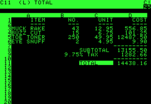
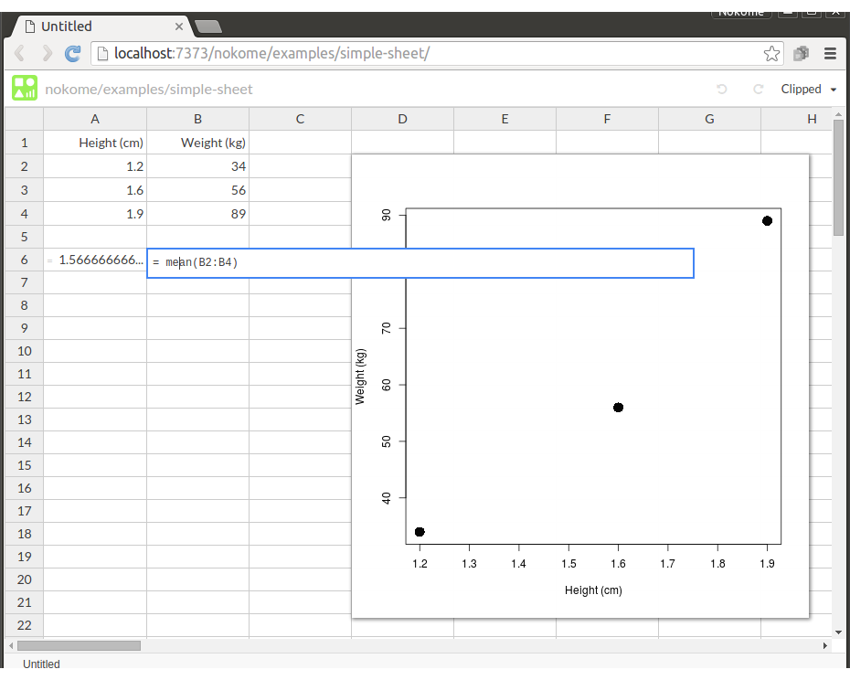
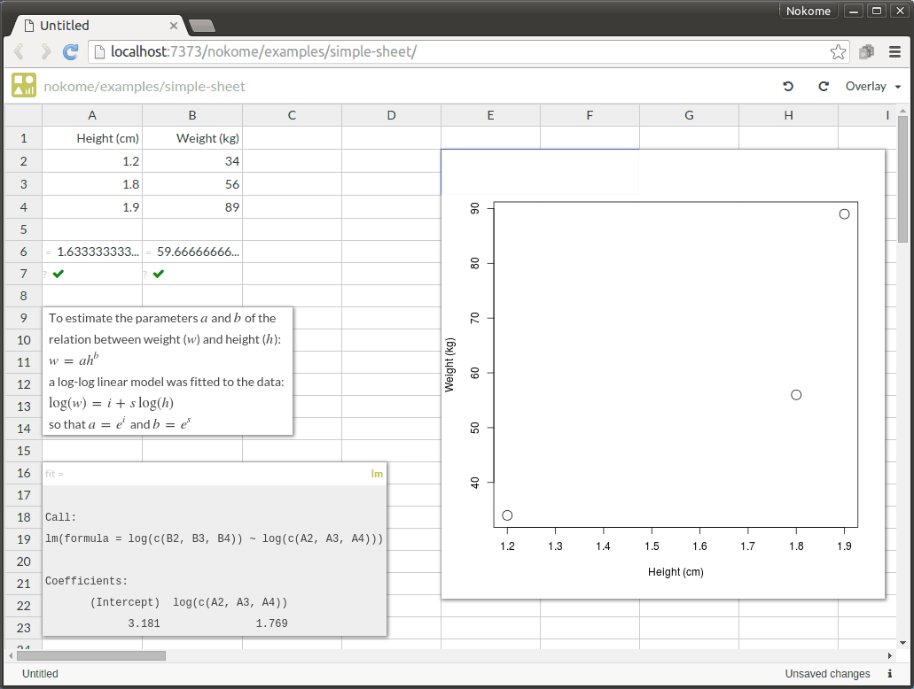

# Birth ...

In 1979, Dan Bricklin and Bob Frankston created VisiCalc the world's first spreadsheet software. VisiCalc was an immediate success, became the Apple II's "killer app" and was credited by Steve Jobs with propelling the first explosion in personal computing. Ted Nelson, an internet pioneer, described the paradigm shift that the spreadsheet interface created,

> VisiCalc represented a new idea of a way to use a computer and a new way of thinking about the world. Where conventional programming was thought of as a sequence of steps, this new thing was no longer sequential in effect: When you made a change in one place, all other things changed instantly and automatically.



Visicalc on the Apple II. Photo: [Wikipedia](https://en.wikipedia.org/wiki/File:Visicalc.png)


Five years later, in a high school on the other side of the world, VisiCalc was the first computer program I ever used. VisiCalc was soon superseded by Lotus 1-2-3 which in turn was usurped by Microsoft Excel, but whatever the software, the spreadsheet paradigm was well and truly established. Like many other scientists, Excel became an integral part of my data analysis and modeling toolbox. `VLOOKUP` and conditional cell formatting became my friends and by the mid 1990s I was programming complicated matrix-based population models using `MMULT` and `PRODUCTSUM`.

But, also like may other scientists, I grew frustrated with the restriction of Excel and the copy-and-paste workflow that seems to go with it. Yes, you can do complicated models in Excel - but there are environments that are better suited to that task. _"Use the right tool for the job"_ they say. So, I saved up my student coins and bought myself a nice shrink wrapped copy of S-plus (and then, not long after, regretted spending all that money when R became a viable successor). Nowadays I very rarely use a spreadsheet. Occasionally I'll fire up LibreOffice Calc or Google Sheets but most of my time I'm looking through Monokai colored glasses at C++, R, Python and Javascript. It's not that I think spreadsheets aren't useful, it's just that you get used to picking up a particular tool off the workbench; and for me, that tool is now code.


# ... death?

Almost forty years on from their birth, spreadsheets are experiencing a midlife crisis - a crisis of confidence, a crisis of reputation. Several high profile spreadsheet errors have amplified the calls against them, particularly in the scientific community. Indeed, when Sylvain Deville started of 2016 by tweeting his list of things that needed to disappear from academic life _"data analysis in excel spreadsheets"_ was at the top. Perhaps the spreadsheet interface has reached the end of it's natural lifespan - at least for _"serious"_ science.

In his blog post _"You probably shouldn't use a spreadsheet for important work"_, Daniel Lemire outlines the common concerns about using spreadsheets.

## Spreadsheets are prone to errors

Lots of spreadsheets seem to have errors in them. Some errors you find along the way but sometimes you publish results based on a buggy spreadsheet. Perhaps the most famous spreadsheet error is that of Carmen Reinhart and Kenneth Rogoff, two Harvard economists who in 2010 published a highly influential paper that has been used to support economic austerity measures. Reinhart and Rogoff's analysis was subsequently found to contain flaws, including, hidden amongst the cells of a spreadsheet the formula `AVERAGE(L30:L44)`. That formula should have been `AVERAGE(L30:L49)` which critics argue results in a significant change in the average GDP growth rate that was calculated from -0.1% to 0.2%. It's highly likely that many other published results are based on spreadsheets with errors but that we will never know about them. To their credit Reinhart and Rogoff shared their spreadsheets so that others could review them. But that leads on to another problem...

## Spreadsheets are opaque

As Lemire and others point out, one of the reasons that spreadsheets often contain errors is that they make code review difficult. Data and code (cells with formulas) are often difficult to distinguish and you need to click each cell to see exactly which is a formula and which is data. Reinhart and Rogoff's mistake might not have been made if it was easier to read all the formulas that their spreadsheet contained.

## Spreadsheets are not testable

All software contains errors at some point. But a key part of developing software is to run tests on it to check for those errors. Tests can be written in spreadsheets, for example a cell with `IF(SUM(A1:A10)=100,"OK","Error")` to check that a column of percentages add up to 100%. But spreadsheet software does not make it easy to write such tests or provide reports on test "coverage" - a software engineering metric for the proportion of your code which is being tested.

## Spreadsheets are not git-able

Version control, now almost synonymous with the version control software `git`, is a key part of modern software development and is becoming increasingly popular for keeping track of scientific documents and data analysis scripts. Having your analysis version controlled allows for another level of transparency and record keeping. But while you _can_ keep an Excel or Google spreadsheet in a `git` repository the file format they use makes it very difficult, if not impossible, to see exactly what changes were made using a command like `git diff`.


# ... or, marriage?

Meanwhile, back in my code-centric world, oblivious to the impeding demise of spreadsheets, I've been exploring approaches to improving openness, accessibility and reproducibility in scientific data analysis. That work is centered around stencils - documents that embed data analysis code (in languages that are good for that sort of thing like R and Python) but which can be edited in the in a familiar WYSIWYG way (this blog post is a stencil that can be edited in a web browser, but more on that later...). 

In December 2015, I was fortunate to be invited to the Collaborative Knowledge (Coko) Foundation's first community meetup to talk about this work. It was a great opportunity to get some feedback from people working around scholarly publishing. But although people definitely saw the need for improving openness, accessibility and reproducibility, a couple of questions really stood out for me:

> What about all the scientists that don't use code for data analysis? Who writes the code that is embedded in these documents? Most scientists still use spreadsheets for data analysis; how does this work for them?

It's easy to fall into the trap of thinking that everyone else has taken the same journey as you - that they know how to write at least a few lines of R code to analyze and plot some data. _"What do you mean there are scientists who don't use Python or R for data analysis?"_ 

There are of course an increasing number of scientists that use code, and universities and organizations like Software Carpentry and Data Carpentry are speeding up that process. But there are a large number of scientists and other researchers who still use a spreadsheet as their goto tool for data-analysis. So these questions made we wonder: do we need to do more to "reach out" to non-coding users, to make reproducible research more accessible, to lighten the codey-ness of it, to reduce the barriers to entry? 

It also made me reflect back on the utility of the spreadsheet interface. All those spreadsheet users aren't forced to use them. The spreadsheet paradigm has endured because it is useful. Useful for quick calculations, rapid prototyping and, importantly, collaboration - everything bundled up in one file - _"Here is the spreadsheet I talked about it's got the data, the formulas and graphs you were interested in"_. If we're really interested in accessible data analysis, then perhaps we should take a closer look at what makes spreadsheets so popular.

I realized that, using the foundations already developed for stencils and the Substance editing library, we could merge the spreadsheet interface with the idea of documents that embedded code. So, a few days after the Coko meet, in a jetlag induced early morning session, myself, Oliver Buchtala and Micheal Aufreiter from Substance, hacked out the first version of Stencila sheets. Urged on by our friends at Coko we've been refining them over the last few months to a demo-able state. It's now time to get some user feedback!

On the surface, Stencila sheets look like any other spreadsheet software. Here's screenshot taken in my web browser of a very simple sheet (you can play with it yourself at [https://stenci.la/nokome/examples/simple-sheet](https://stenci.la/nokome/examples/simple-sheet)):



## Sheets are code + reactive programming

So, what's the point? How is this any different to Excel or Google Sheets? Well, in conventional spreadsheets, formulas like `= AVERAGE(B2:B4)` use a syntax that is evaluated by the spreadsheet software itself. In a Stencila sheet, the cell formulas are evaluated with a host language, in this case, the statistical language R, and assigned to a variable with the cell id. So, when I entered `34` into cell B2, it was equivalent to writing `B2 <- 34` in an R console. When I entered `mean(B2:B4)` in cell B6, the cell range `B2:B4` gets translated into a list of R variables, so what actually gets executed is equivalent to `B6 <- mean(c(B2,B3,B4))`. 

Cells don't have to hold just fundamental types like numbers and strings. Cell expressions can be evaluated to any type of object in the host language. For example, if I enter `fit = lm(log(B2:B4)~log(A2:A4))` into A16, we get a string representation of the fitted linear model (the result of the `lm` function in R). In cell D2 I entered `= plot(A2:A4,B2:B4,xlab=A1,ylab=B1,pch=16,cex=2)` which produced the image in the top-right. 

Isn't this just executing code in cells instead of lines? No, sheets maintain the innovation of VisiCac - live, reactive programming - what makes spreadsheets so, well, intuitive. When you make a change in a cell, all the cells that depended on it change too. Even the cells for the complicated objects like that R linear model in A16. Stencila sheets does this by analyzing the dependencies of each cell expression and maintains a dependency graph so that the right cells get updated in the right order.



The user interface for sheets is still pretty rudimentary and we still need to implement many of the user interactions that a spreadsheet needs (e.g creating cell ranges using the mouse instead of having to type them in). Instead, we've focused our attention on trying to address some of the shortcomings, described above, of traditional spreadsheet software.

## Sheets are more testable

We have added testing to sheets. Authors can write explicit test cells (the one's with a leading question mark and a green check mark in the screencast above) which define checks of the equations and/or data e.g. `? A6>1 && A6<3`. If the test fails the check mark changes to a red cross. A user can generate a test report for a sheet which tells them exactly how many tests passed, failed or errored. And because sheets maintain a cell dependency graph a sheet can report the test coverage.

## Sheets are more transparent and git-able

Sheets are stored as a plain tab-delimited file `sheet.tsv`. It's the sheet's "source code" file: it exposes all the data, equations, documentation and checks in one place, making a sheet open, transparent and easily audited. And because `sheet.tsv` is plain text, one row for each cell, it fits well with version control and differencing using tools like `git`.

```
A1	"Height (cm)"
A2	1.2
A3	1.6
A4	1.9
A6	= mean(A2:A4)
A7	? A6>1 && A6<3
A9	_ To estimate the parameters |a| and |b| of the {br} relation between weight (|w|) and height (|h|): {br} |w=ah^b| {br} a log-log linear model was fitted to the data: {br} |log(w)=i+slog(h)| {br} so that |a=e^i| and |b=e^s|
A16	fit = lm(log(B2:B4)~log(A2:A4))	ove
A25	"a"
A26	"b"
B1	"Weight (kg)"
B2	34
B3	56
B4	89
B6	= mean(B2:B4)
B7	? B6>20 && B6<150
B25	= exp(fit$coef[1])
B26	= exp(fit$coef[2])
E2	= plot(A2:A4,B2:B4,xlab=A1,ylab=B1,pch=1,cex=2)
```

We've got a bunch of other ideas for making sheets more robust and more accessible including mapping cell ranges to underlying object to reduce formula repetition, native data visualization and exposing sheets via a RESTful web API. For more on these ideas and how sheets work under the hood check out the [underneath the sheets](https://stenci.la/stencila/blog/underneath-sheets) follow up post. Also, if you're a `git` user, you can clone the above example sheet `git clone https://stenci.la/nokome/examples/simple-sheet.git` to get under the hood some more.


# Vigorous hybrid or unwanted love child?

Amongst people that analyze data, there seem to be two camps: there are code users, there are Excel users, but there aren't many who regularly use both. Could that mean that Stencila sheets enters a no-mans land, not really appealing to either side? Or does it provide an opportunity to bridge those two worlds - a platform for collaboration in which the coders can still write code and the spreadsheet users can still use the interface they are used to?

Or, should we just focus our efforts on encouraging scientists to leave the vast spreadsheet-desert and come over to our code-oasis? Efforts to improve programming literacy amongst scientists are valuable and should be continued. But there is a danger of overdoing it. Proficiency in a computer language is a skill and like all skills it requires investment of time: time spent in learning, in practice and in keeping up-to-date. That time is time that could be spent on doing the other things it takes to be a scientist like reading journals, thinking of hypotheses, designing experiments, getting out in the field. So while improving code literacy amongst scientists is a good thing, we need to be careful not to turn them all into professional computer coders - the world needs scientists too. This echoes the sentiment of Bob Frankston's talk to the National Computer Conference in 1979 in where he and Dan Bricklin launched VisiCalc,

> The current attempt to get every-one to learn and use BASIC is not the answer. Much of what is involved in programming is conceptualization and description - the hard parts of problem solving. Even the ultimate in general-purpose procedural languages will not remove the difficulties in programming. These languages are, of course, necessary for those people who do programming, such as the personal computer software engineers. But there are simply not enough programmers available to write all of the canned applications that can be anticipated. Thus our task as professionals becomes one of finding {strong the appropriate level of tools that correspond to the level at which the user deals with an application}. [...] VisiCalc brings the user a familiar, and powerful, combination of a calculator and paper which permits the user to make {strong effective use of the personal computer without the over-head of programming nor the constraints of canned application packages}.

Instead of attempting to convert everyone to our code-centric perspective perhaps we should focus on developing software tools for data analysis that have multiple, alternative interfaces suited to different types of users - code for coders; buttons and dropdowns for clickers. In "Spreadsheets are alive, spreadsheets are dead", Nathan Brixius concludes,

> While there is room in the world for both spreadsheet and software solutions, the formalization of analytics as a discipline will inspire a “third way” for analytics development that will increasingly replace both. [...] The third way will combine the benefits of both spreadsheets and programming but will be able to be used by anyone with the skills to clearly express their intent to the system. [...] Until this day arrives, both spreadsheets and software development will remain indispensable for analytics. The data science movement should pause to consider the fact that if spreadsheets vanished today, the number of people building predictive and prescriptive analytics would decrease by an order of magnitude. This community should not be so easily dismissed.

Stencila sheets attempt to provide some of the "third way" that Brixius refers to. By having multiple interfaces to the same underlying document we provide a natural segue for scientist to transition from clicking to coding and back again. Let the user choose the tool that is right for _them_.


# Further Reading

Dan Bricklin's [page on VisiCalc](http://danbricklin.com/visicalc.htm), Bob Frankston's [talk on VisiCalc to the National Computer Conference](http://www.frankston.com/public/?name=VisiCalcPaper), a [video of Steve Jobs](https://www.youtube.com/watch?v=IU96Pd_npn4) describing it's importance in the history of personal computing, and Mike James on why [spreadsheets are special](http://www.i-programmer.info/professional-programmer/i-programmer/1452-spreadsheets-are-special.html).

Daniel Lemire's ["You shouldn’t use a spreadsheet for important work (I mean it)"](http://lemire.me/blog/2014/05/23/you-shouldnt-use-a-spreadsheet-for-important-work-i-mean-it/), and the ensuing [discussions on Hacker News](https://news.ycombinator.com/item?id=7803830). On the Reinhart-Rogoff affair: ["Is the evidence for austerity based on an Excel spreadsheet error?""](https://www.washingtonpost.com/news/wonk/wp/2013/04/16/is-the-best-evidence-for-austerity-based-on-an-excel-spreadsheet-error/) and ["Sloppy math and the austerity debate"](https://cunymathblog.commons.gc.cuny.edu/2013/05/06/sloppy-math-and-the-austerity-debate/).

Felienne Hermans' talk ["Spreadsheets are code"](http://www.slideshare.net/Felienne/spreadsheets-are-code-online) on applying software engineering methods to spreadsheets and Nathan Brixius on the [need to combine the befits of spreadsheets and programming](https://nathanbrixius.wordpress.com/2015/07/27/spreadsheets-are-alive-spreadsheets-are-dead/). [Pyspread](http://manns.github.io/pyspread/) a desktop spreadsheet program that uses Python expressions in cells.
