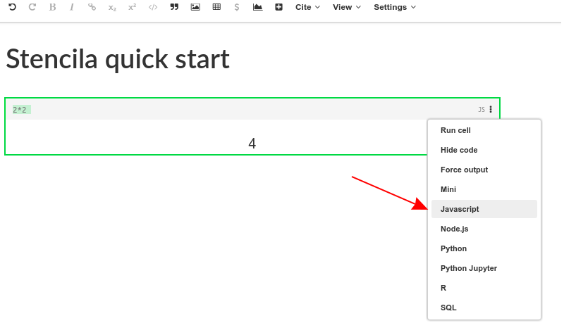

Stencila allows you use interactive JavaScript code  within Stencila articles, notebooks and sheets. JavaScript comes with basic Stencila installation so you can
manipulate and visualise data using JavaScript straight from the start.

If you want the code in the code cell be interpreted as JavaScript, you need to select the `JS` context:

{style="align:center; width:100%" }


## Cells

With Stencila you have full control over the sequence in which your code cells are executed. You can run the code in asynchronous order.
You can refer to specific outputs from the given cell in any part of your Stencila document.
Stencila does all this using its [execution engine](computation/engine.md).

The engine manages automatic dependencies between the cells which are specific for each language. For cells written in Javascript, if you want to capture the output of the cell,
create a variable and assign (`=`) the output.
Note that the variables in Stencila are non-mutable :sparkles: . Whatever is on the right hand of the assignment (`=`)
will become the cell input.

You can the refer to this cell's input and output in the Stencila document.

If you do not capture the output explicitly, you will not be able to refer to it later on. But the input of the cell
will still be available.

For example:

```js
x = 4
Math.sqrt(x)
```

The input for this cell is `x`, the output is empty (`null`) and the value is 2 (`Math.sqrt(4)`).

If you want to caputure the output and be able to refer back to it in the future you need to
modify the cell as follows:

```js
x <- 4
y <- Math.sqrt(x)
```

The output is now `y` and you can refer back to this variable in any other cell in Stencila.


## Functions


Stencila functions can be implemented using Javascript. To match Stencila's call semantics with Javascript's it is necessary to set the `pars` property on the Javascript function


```js
function square(value) {
  return value * value
}
```


When a parameter is repeatable, prefix the argument name with an ellipsis e.g.

```js
function sum(...value) {
  // Implementation goes here
}
sum.pars = ['...value']
```

```mini
sum(3, [])
```

```js
function sum(...values) {
  let result = 0
  for (let value of values) {
    const type_ = type(value)
    switch (type_) {
      case 'number':
        result += value
      case 'array[number]':
        for (let item of value) result += value
      default:
        type_error(type_)
    }
  }
  return result
}
sum.pars = ['...values']
```


## Data interchange
