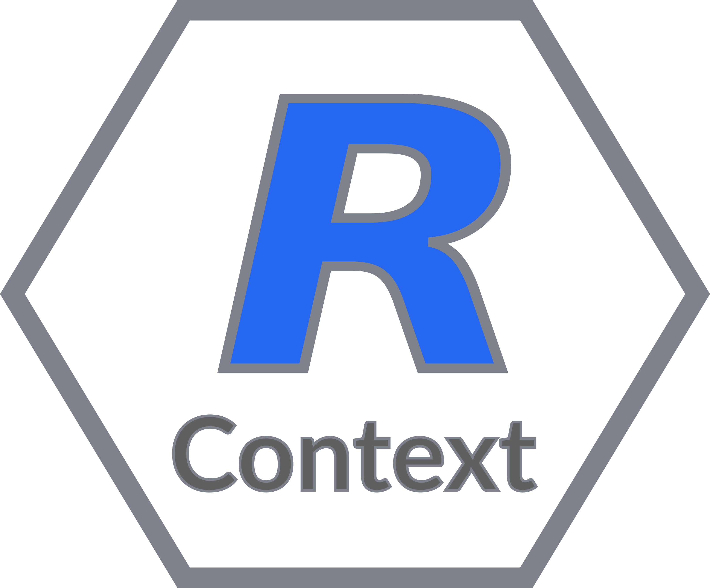

{style="display: inline; width: 25%; margin: 0 auto; padding-right: 1em; padding-top: 1em; float: left;" }

Stencila allows you use interactive R code within Stencila articles, notebooks and sheets.
In order to be able to use R within Stencila documents you need to
[enable the execution context](#installation).

You can write R code
just like you would in any other editor or reproducible notebook. You can install R packages and import them,
create and embed plots, and so on.

You can write the contents of Stencila cells in R as well as make your existing R functions available in Stencila through [function libraries](#functions).

## Installation

>! We are currently working on making the Stencila R package compatible with the latest Stencila Desktop. During that process, not all functionality may be available.

The [Stencila R package](https://github.com/stencila/r) provides a `RContext` for executing R code and functions from within Stencila documents.

The package is not yet available on CRAN, so you need to install directly from our Github repository using the [`devtools`](https://github.com/hadley/devtools) package.

>i You may need to install `devtools` first using `install.packages("devtools")` from within an R session

Launch a R session on your machine and type:

```r
devtools::install_github("stencila/r")
```

Then register the package's manifest so that it can be found by the Stencila Desktop and other Stencila packages,

```r
stencila:::register()
```

## Code execution

Stencila keeps track of the code dependecies between the code cells. It supports reactive programming which means that the code and the respective outputs
will get updated, when you change a piece of code they depend on. It is a similar principle as behind the behavior of spreadsheet applications.
You can refer to specific outputs from any code cell in any part of your Stencila document. Stencila does all this using its [execution engine]().

What inputs and outputs of a code cell are vary slightly between programming languages that you use in Stencila.  For cells written in R,
if you want to capture the output of the cell so that you can refer to it throughout the document, you need to create a variable and assign (`<-`) the output. To be more precise, you are capturing the _result of the evaluation of the cell_.
Note that, the variables in Stencila are non-mutable.

For example:

```r
x <- 4
y <- sqrt(x)
```
Now you can refer to the output of the cell using the variable `y`.

If you do not capture the output explicitly, you will not be able to refer to it later on. For example:

```r
x <- 4
sqrt(x)
```

The result of the `sqrt(x)` is `2` but you will not be able to refer to it since it has not been captured explicitly in a variable.
Summarizing: the output of this cell is not captured and the result of evaluating this cell is `2` (`sqrt(4)`).


## Data interchange

Stencila provides you with ability to use multiple programming languages to write interactive code within
one document, working on the same data. In other words, you can manipulate the same data switching between different programming
languages. This capability is achieved through `data interchange` feature.

When you pass data between cells Stencila temporarily converts it into its internal schema representation.
The table below shows (roughly) how data interchange between the schema and R is implemented. For more details
see [source code](https://github.com/stencila/r/blob/master/R/type.R).

| Schema representation | R                    |
|:----------------------|:---------------------|
| Boolean               | logical              |
| Integer               | integer              |
| Float                 | numeric              |
| String                | character            |
| Array                 | R vector             |
| Object\*              | R list               |
| Table                 | DataFrame, matrix    |
| Plot                  | recordedplot, ggplot |

\*The object fields and methods are saved within the schema-defined object/array and converted accordingly.
